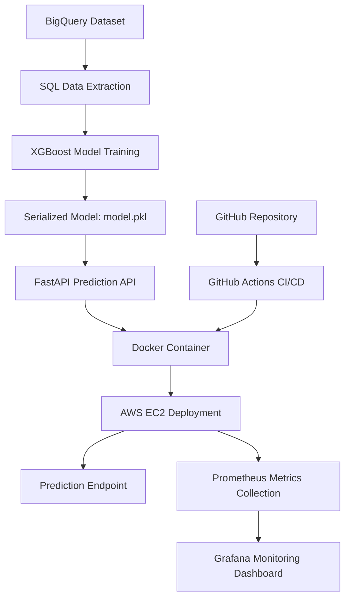
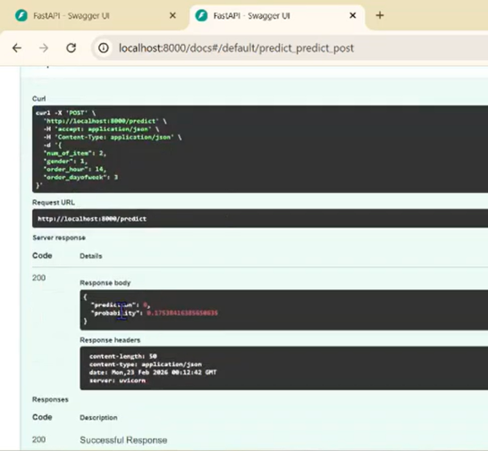
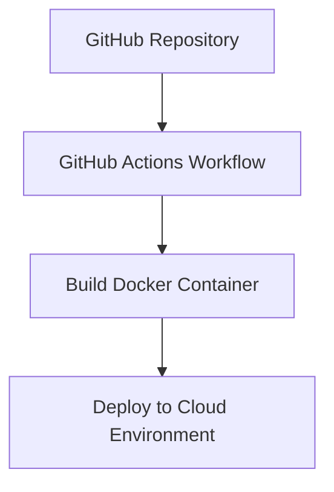

# Cloud-Native Order Cancellation Prediction Application
## Architecture

The system follows a cloud-native architecture where data is used to train a machine learning model that is deployed as a containerized microservice.


Key components of the architecture include:

- BigQuery dataset used for training data
- XGBoost machine learning model
- FastAPI microservice exposing the prediction endpoint
- Docker container for consistent runtime environments
- Cloud deployment environment
- Monitoring tools for application health and performance

This architecture demonstrates a cohesive cloud-native analytics application pipeline.

## Prediction API



## Prediction API


----------------------------------------------------
### Dataset
The model is trained using the **thelook_ecommerce** dataset available in BigQuery Public Data.
A subset of the dataset is extracted using SQL to create a training dataset containing order attributes and cancellation status.
Example query used to extract training data:
```sql
SELECT
  num_of_item,
  gender,
  EXTRACT(HOUR FROM created_at) AS order_hour,
  EXTRACT(DAYOFWEEK FROM created_at) AS order_dayofweek,
  IF(status = 'Cancelled', 1, 0) AS is_cancelled
FROM `bigquery-public-data.thelook_ecommerce.orders`
ORDER BY RAND()
LIMIT 8000
```
This query extracts key order attributes and generates a binary label (`is_cancelled`) used to train an XGBoost classifier that predicts order cancellation risk.

-------------------------------------------------
### Machine Learning Model
An **XGBoost classifier** is trained to predict order cancellation risk.
Features used
- number of items in the order
- customer gender
- order hour
- day of week

Target variable `is_cancelled`

#### Training workflow
1. Extract training data from BigQuery
2. Perform preprocessing and feature encoding
3. Train an XGBoost classifier
4. Evaluate model performance
5. Save the trained model as a serialized artifact

The trained model is saved as: `model.pkl`

This serialized model file is later loaded by the prediction service.

-----------------------------------------------------
## Prediction API
The trained model is deployed through a FastAPI microservice.  
The service exposes a REST endpoint: `POST /predict`

The API accepts order attributes as input and returns a prediction and probability.

### Example Request

```json
{
 "num_of_item": 2,
 "gender": 1,
 "order_hour": 14,
 "order_dayofweek": 3
}
```
### Example Response
```json
{
 "prediction": 0,
 "probability": 0.18
}
```
The API performs the following steps:

1. Receive JSON input
2. Convert input into feature vector
3. Pass features to the XGBoost mode
4. Return prediction and probability

This demonstrates a real-time machine learning inference service.

-----------------------------------
### Containerization
The application is containerized using Docker to ensure consistent runtime environments across development and deployment.

The Docker container includes:

- FastAPI application
- trained model file
- Python dependencies

Example Dockerfile:
```python
FROM python:3.12-slim
WORKDIR /app
COPY requirements.txt .
RUN pip install --no-cache-dir -r requirements.txt
COPY app.py .
COPY model.pkl .
EXPOSE 8000
CMD ["uvicorn", "app:app", "--host", "0.0.0.0", "--port", "8000"]
```
Containerization allows the application to be deployed consistently across different cloud environments.

---------------------------------
### Deployment from GitHub
The project source code is stored in a GitHub repository.

A GitHub Actions workflow is used to automatically build the application when new code is pushed to the repository.

Deployment pipeline:


This automated pipeline demonstrates continuous integration and deployment practices commonly used in cloud-native applications.
### Monitoring
The deployed application is monitored using cloud monitoring tools.

Monitoring dashboards track metrics such as:
- service availability
- request activity
- system health
Monitoring ensures that the application remains operational and provides visibility into system performance.

### How to Run the Application Locally
#### Build Docker Image
`docker build -t cancellation-api .`
#### Run Container
`docker run -p 8000:8000 cancellation-api`
#### Access API Documentation
Open:
`http://localhost:8000/docs`

The Swagger interface allows users to test the prediction API directly.

### Repository Structure
```
ml-cancellation-project
│
├── screenshots
│   ├── API.png
│   └── monitoring.png
├── app.py
├── train_model.py
├── model.pkl
├── Dockerfile
├── requirements.txt
└── README.md
```
## Conclusion
This project demonstrates how a machine learning model can be integrated into a cloud-native analytics application. The system includes data extraction, model training, containerized deployment, automated build pipelines, and monitoring.

By combining machine learning with modern cloud infrastructure, the application provides a scalable framework for deploying predictive analytics services in production environments.
